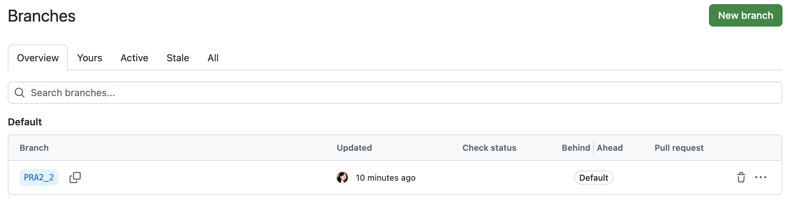
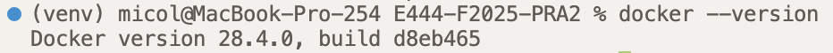
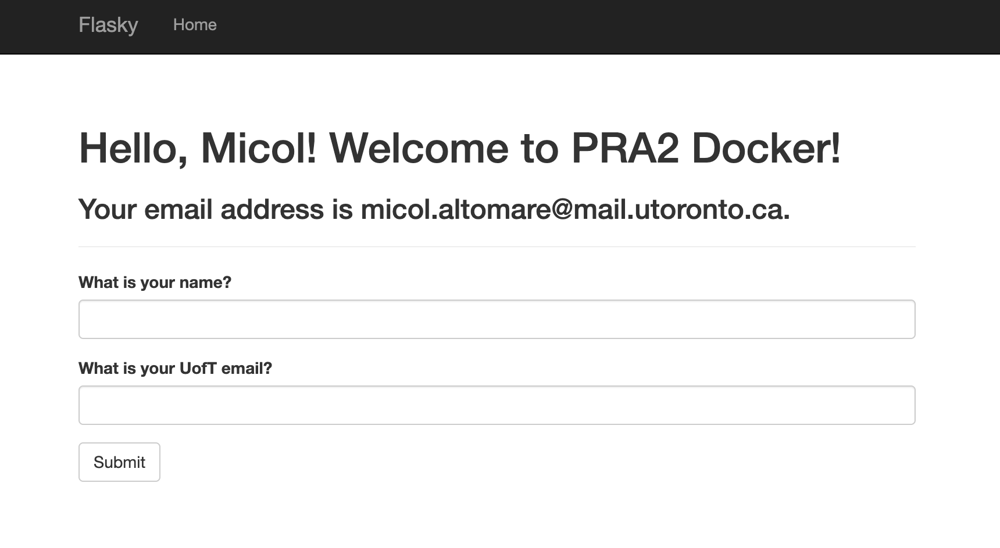
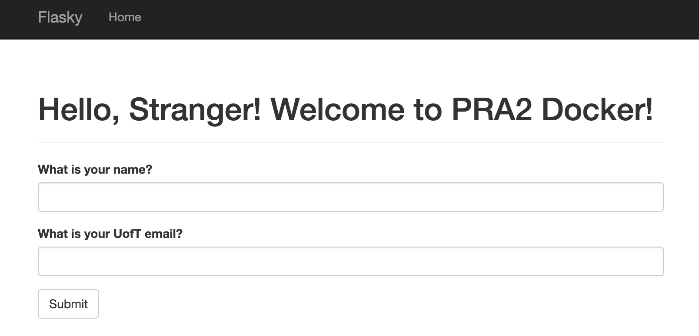

# E444-F2025-PRA2
Micol Altomare

Credit: this repo is a clone of https://github.com/miguelgrinberg/flasky.

## Activity 1.1


## Activity 1.2


## Activity 1.3


## Activity 1.4


## Activity 2.1


## Activity 2.2


## Activity 2.3


## Activity 2.4



#### Useful Commands:
``` docker build -t flasky . ```

``` docker run -p 5001:5000 flasky ```

``` docker ps ```
